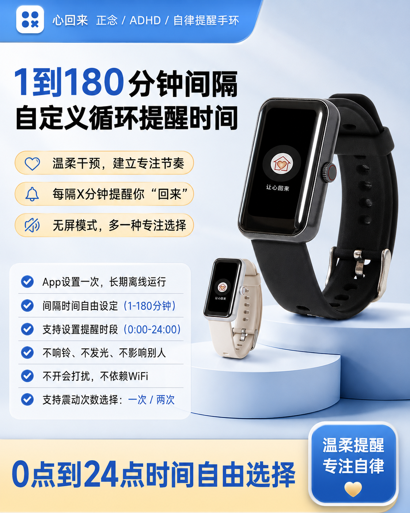
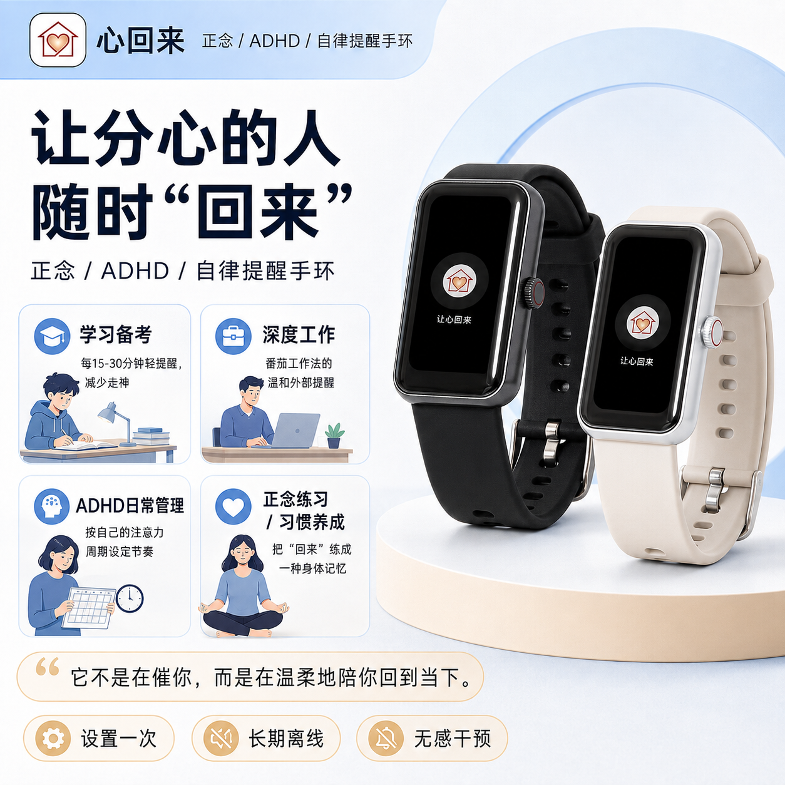

# 心回来 (Xinhuilai) · 微信小程序 BLE 蓝牙通信 SDK

<div align="center">
  
  <h3>免下 App · 扫码即连 · 极简配置</h3>
  <p><b>广州觉见科技有限公司 (Guangzhou Juejian Technology Co., Ltd.) 官方开源工程</b></p>
  <p>
    <a href="https://www.awansight.com">官方旗舰网站</a> •
    <a href="https://www.awansight.com/xinhuilai/">手环使用说明书</a> •
    <a href="https://github.com/sinianchu9/xinhuilai-Android">Android 客户端</a> •
    <a href="https://github.com/sinianchu9/xinhuilai_ios">iOS SDK</a>
  </p>
  <p>
    
    
    
    
  </p>
</div>

---

## 1. 概述

本小程序 SDK 由 **广州觉见科技有限公司**（以下简称“本公司”）专门为旗下核心自研硬件 **「心回来」正念 / ADHD / 自律提醒智能手环** 开发，旨在为微信小程序生态提供安全、轻量、高可用的低功耗蓝牙 (BLE) 控制与生理数据同步平台。

无需让用户下载几十兆的原生 App，通过微信小程序即可完成手环配对、1~180分钟循环提醒时间设定、五种静音震动模式切换及常灭屏省电控制。配置完成后，手环 **100% 独立离线运作**。

<div align="center">
  
  
</div>

---

## 2. 运行环境与兼容性

| 类别 | 范围 | 备注 |
| :--- | :--- | :--- |
| **微信客户端** | Android，iOS，HarmonyOS 4.0，HarmonyOS NEXT | 完整支持标准 BLE 协议 |
| **开发平台** | 微信开发者工具 (最新稳定版) | 推荐使用原生 + TypeScript 模式 |

> **接入提示**：SDK 基于微信小程序原生蓝牙接口深度封装，提供强类型 TS 定义。不建议使用 mpvue、uni-app、Taro 进行黑盒编译混淆，以免破坏上下文生命周期与蓝牙状态机。

---

## 3. 快速接入指南

### 3.1 初始化蓝牙适配器
```typescript
import { JuejianBleSDK } from './libs/vp_sdk/index';

// 1. 初始化
JuejianBleSDK.initAdapter({
  onStateChange: (available) => {
    console.log('手机蓝牙可用状态:', available);
  }
});
```

### 3.2 扫描并连接心回来手环
```typescript
JuejianBleSDK.startScan({
  deviceName: '心回来', // 或根据 MAC 过滤
  onDeviceFound: (device) => {
    console.log('发现心回来设备:', device.deviceId, device.RSSI);
    // 停止扫描并发起连接
    JuejianBleSDK.connect(device.deviceId, {
      pwd: '0000', // 默认密码鉴权
      onSuccess: () => {
        wx.showToast({ title: '心回来手环连接成功', icon: 'success' });
      }
    });
  }
});
```

### 3.3 设置 1~180 分钟循环提醒与震动模式
```typescript
// 下发番茄工作法节奏：每 25 分钟震动一次，工作时间 08:30 - 21:00
JuejianBleSDK.setReminderRhythm({
  interval: 25,              // 1~180 分钟
  vibeMode: 1,               // 1:单次柔和, 2:单次增强, 3:双次柔和, 4:一柔一强, 5:双次增强
  startHour: 8, startMin: 30,
  endHour: 21, endMin: 0,
  onSuccess: () => {
    wx.showToast({ title: '专注节律设置成功，手环已进入离线运行状态', icon: 'none' });
  }
});
```

### 3.4 开启极简无屏专注模式
```typescript
// 常灭屏开启后，手环完全屏息，仅依靠触感传递时间知觉
JuejianBleSDK.setAlwaysOffScreen(true);
```

---

## 4. 目录结构

```
|- code/             # 官方体验工程 (WeiXinSDKTSDemo)
|- docs/
│   |- images/       # 官方产品高清实物图谱
│   |- txt/          # HRV、睡眠、健康文字解释字典
│   └─ 心回来SDK接口详细说明书.md
|- libs/             # 广州觉见科技核心蓝牙驱动库
    |- jieli_sdk/
    └─ vp_sdk/
```

---

## 5. 商业招商与定制合作

心回来手环全面支持针对学校考研机构、专注力自习室、心理咨询中心、养老守护及企业工会礼品的批量集采与软硬件二次开发。

- **官方网站**：[https://www.awansight.com](https://www.awansight.com)
- **手环说明书（线上在用）**：[https://www.awansight.com/xinhuilai/](https://www.awansight.com/xinhuilai/)
- **主办单位**：广州觉见科技有限公司 (Guangzhou Juejian Technology Co., Ltd.)
- **资质合规**：统一社会信用代码 `91440106MAEK57T60Q` | 粤ICP备2025430838号-2
- **知识产权**：国家知识产权局第 **88823416** 号「心回来」注册商标专用权

Copyright (c) 2026 **广州觉见科技有限公司** All rights reserved.
